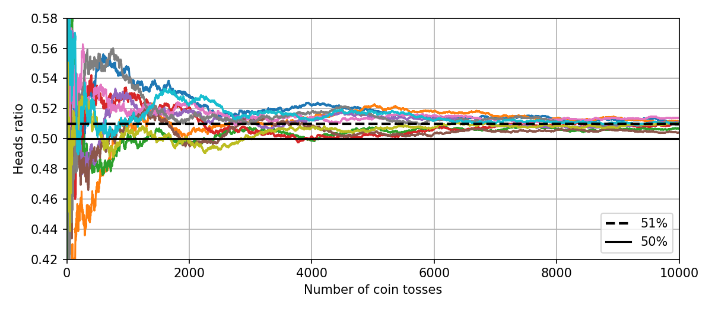
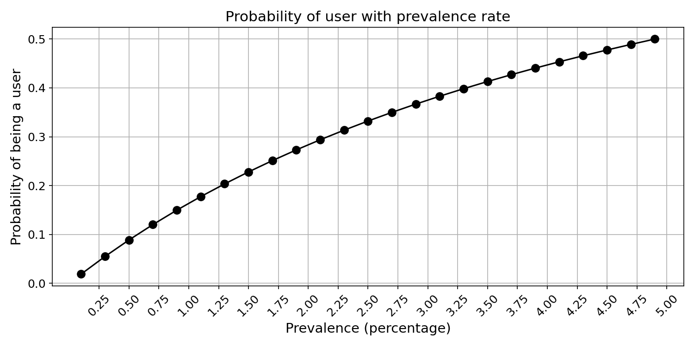

# 📊 Practical Mathematics & Statistics in Python

A hands-on collection of mathematical and statistical concepts brought to life through Python simulations and visualizations.

This project is an ongoing effort to explore, implement, and visualize core ideas from **mathematics** and **statistics** — making theory tangible through code.

---

## 🚀 Topics Covered

### 1. Law of Large Numbers (LLN)

> *As the number of trials increases, the sample average converges to the expected value.*

**Notebook:** [`LLN.ipynb`](LLN.ipynb)

We simulate **10,000 tosses** of a slightly biased coin (P(heads) = 0.51) across **10 independent experiments**. The plot below shows how each experiment's cumulative heads ratio converges toward the true probability as the number of tosses grows — a direct demonstration of the Law of Large Numbers.



**Key observations:**
- Early tosses show high variance — the heads ratio fluctuates wildly.
- As the number of tosses increases, all 10 experiments converge toward the true probability of **51%**.
- The difference between 50% (fair coin) and 51% (biased coin) becomes distinguishable only with a large sample size.

---

### 2. Monte Carlo Integration

> *Approximate definite integrals using random sampling instead of deterministic grids.*

**Notebook:** [`monte_carlo_integrations.ipynb`](monte_carlo_integrations.ipynb) | **Explainer:** [`monte_carlo_integration.md`](monte_carlo_integration.md)

We compute the integral $\int_{0}^{4}\sqrt[4]{15x^3+21x^2+41x+3} \cdot e^{-0.5x}\,dx$ using random sampling, compare it against Riemann sums, and visualize how the estimate converges to the true value as the sample size grows.


**Key observations:**
- Monte Carlo estimates converge to the true integral value as sample count increases.
- The distribution of estimates follows a normal distribution (Central Limit Theorem).
- The method scales to high-dimensional problems where grid-based methods fail.

---

### 3. Bayes' Theorem

> *A positive test result doesn't mean what you think it means — when the condition is rare, false positives dominate.*

**Notebook:** [`bayes_theorem.ipynb`](bayes_theorem.ipynb) | **Explainer:** [`bayes_theorem.md`](bayes_theorem.md)

We explore Bayes' Theorem through a drug testing scenario: a test with 97% sensitivity and 95% specificity is applied to a population where only 0.5% are actual users. Despite the test's apparent accuracy, a positive result only implies an ~8.9% chance the person is a user. The notebook investigates how prevalence, sensitivity, and specificity each affect the posterior probability, and demonstrates **sequential Bayesian updating** across multiple test rounds.



**Key observations:**
- Low prevalence causes even accurate tests to produce mostly false positives (base rate fallacy).
- Specificity has the strongest effect on posterior probability when conditions are rare.
- Sequential testing (using the posterior as the next prior) rapidly increases confidence — 3 positive tests bring it from 8.9% to 97.3%.

---

## 🛠️ Tech Stack

- **Python 3**
- **NumPy** — numerical computation & random sampling
- **SciPy** — scientific computing & numerical integration
- **Matplotlib** — data visualization

## 📦 Getting Started

```bash
# Clone the repository
git clone <repo-url>
cd Stat_maths

# Install dependencies
pip install numpy matplotlib scipy

# Open the notebooks
jupyter notebook
```

## 📌 Roadmap

This is a living project. More topics will be added over time, including but not limited to:

- [ ] Central Limit Theorem
- [x] Bayes' Theorem
- [x] Monte Carlo Integration
- [ ] Probability Distributions
- [ ] Hypothesis Testing
- [ ] Markov Chains
- [ ] Regression Analysis

---

## 🤝 Contributing

Ideas, suggestions, and contributions are welcome! Feel free to open an issue or submit a pull request.

## 📄 License

This project is open-source and available under the [MIT License](LICENSE).
