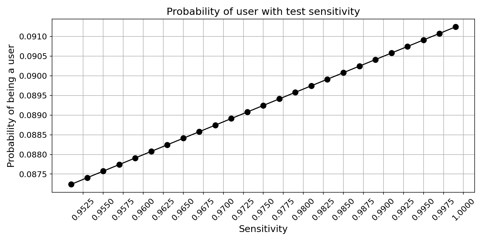
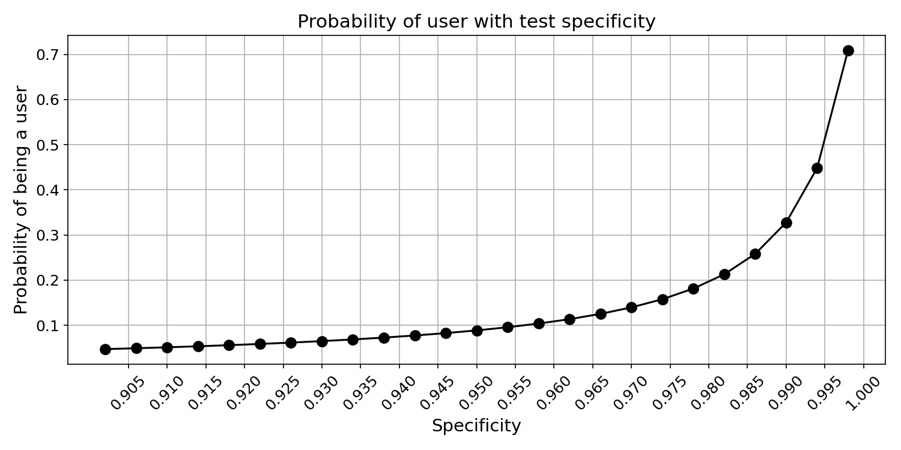

# Bayes' Theorem — Drug Testing Example

## The Problem

A company implements mandatory drug testing for its employees. The test is highly accurate:

- **Sensitivity** (true positive rate): 97% — if someone *is* a user, the test correctly flags them 97% of the time.
- **Specificity** (true negative rate): 95% — if someone is *not* a user, the test correctly clears them 95% of the time.

Sounds reliable, right? But here's the twist: only **0.5%** of the population actually uses the drug. If an employee tests positive, **what is the probability they are actually a drug user?**

Most people guess ~95%. The real answer: **~8.9%**.

---

## The Math

Bayes' Theorem lets us reverse conditional probabilities:

$$P(\text{User}|+) = \frac{P(+|\text{User}) \cdot P(\text{User})}{P(+)}$$

Expanding the denominator using the law of total probability:

$$P(\text{User}|+) = \frac{P(+|\text{User}) \cdot P(\text{User})}{P(+|\text{User}) \cdot P(\text{User}) + P(+|\text{Non-user}) \cdot P(\text{Non-user})}$$

Where:

| Symbol | Meaning | Value |
|---|---|---|
| $P(\text{User})$ | Prevalence rate | 0.005 |
| $P(\text{Non-user})$ | $1 - \text{Prevalence}$ | 0.995 |
| $P(+\|\text{User})$ | Sensitivity | 0.97 |
| $P(-\|\text{Non-user})$ | Specificity | 0.95 |
| $P(+\|\text{Non-user})$ | False positive rate | $1 - 0.95 = 0.05$ |

Plugging in:

$$P(\text{User}|+) = \frac{0.97 \times 0.005}{0.97 \times 0.005 + 0.05 \times 0.995} = \frac{0.00485}{0.05460} \approx 0.089$$

**Only 8.9%!** Despite the test being 97% sensitive and 95% specific, a positive result means there's less than a 1-in-10 chance the person is actually a user. The low prevalence rate drowns out the signal.

---

## Implementation

```python
def drug_user(prob_th=0.5, sensitivity=0.99, specificity=0.99, prevelance=0.01, verbose=True):
    p_user = prevelance
    p_nonuser = 1 - prevelance
    p_pos_user = sensitivity
    p_pos_nonuser = 1 - specificity

    num = p_pos_user * p_user
    den = p_pos_user * p_user + p_pos_nonuser * p_nonuser
    prob = num / den

    if verbose:
        if prob > prob_th:
            print("The test taker could be a user")
        else:
            print("The test taker may not be a user")
    return prob
```

---

## How Each Parameter Affects the Result

### 1. Effect of Prevalence Rate

As the base rate of drug use in the population increases, a positive test result becomes far more meaningful.


At 0.5% prevalence, a positive test means ~9% chance of being a user. At 5% prevalence, it jumps to ~50%. **The rarer the condition, the more false positives dominate.**

### 2. Effect of Sensitivity

Increasing the test's ability to detect true users (sensitivity) has a relatively modest impact on the posterior probability when prevalence is low.



Even pushing sensitivity from 95% to ~100% only nudges the probability from ~5% to ~10%. **Sensitivity alone can't overcome a low base rate.**

### 3. Effect of Specificity

Specificity has a **dramatic** effect. Reducing the false positive rate is the most powerful lever.



Going from 90% to 99.9% specificity causes the posterior probability to skyrocket. **When the condition is rare, even a small false positive rate generates a flood of false alarms.**

---

## Sequential Testing — The Bayesian Update

What if we test the same person **multiple times**? Each positive result updates our prior:

| Round | Prior (Prevalence) | Posterior $P(\text{User}\|+)$ |
|---|---|---|
| 1st test | 0.005 | **0.089** |
| 2nd test | 0.089 | **0.654** |
| 3rd test | 0.654 | **0.973** |

```python
p1 = drug_user(sensitivity=0.97, specificity=0.95, prevelance=0.005)   # 0.089
p2 = drug_user(sensitivity=0.97, specificity=0.95, prevelance=p1)      # 0.654
p3 = drug_user(sensitivity=0.97, specificity=0.95, prevelance=p2)      # 0.973
```

After **three consecutive positive tests**, we're 97.3% confident the person is a user. This is the power of **Bayesian updating** — each round uses the posterior from the previous round as the new prior.

---

## Key Takeaways

| Insight | Detail |
|---|---|
| **Base rate fallacy** | Ignoring prevalence leads to wildly overestimating the meaning of a positive test |
| **Specificity matters most** | When conditions are rare, false positive rate is the dominant factor |
| **Sequential testing works** | Multiple rounds of testing rapidly increase confidence via Bayesian updating |
| **Real-world applications** | Medical diagnostics, spam filtering, fraud detection, criminal justice |

Bayes' Theorem is not just a formula — it's a framework for **updating beliefs with evidence**, and this drug testing scenario is one of the most powerful demonstrations of why raw test accuracy can be deeply misleading.
