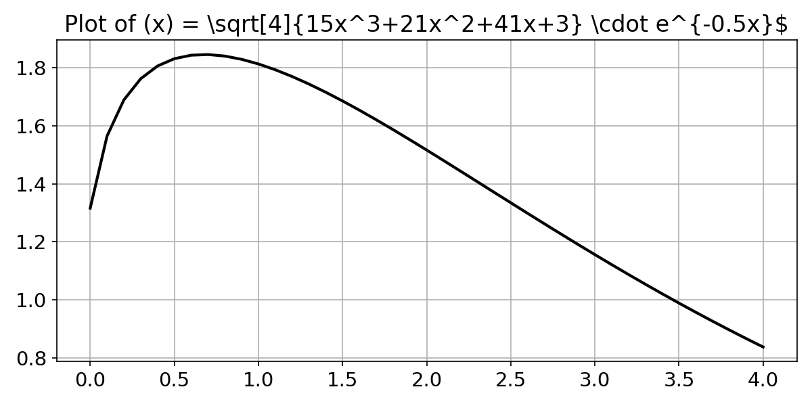
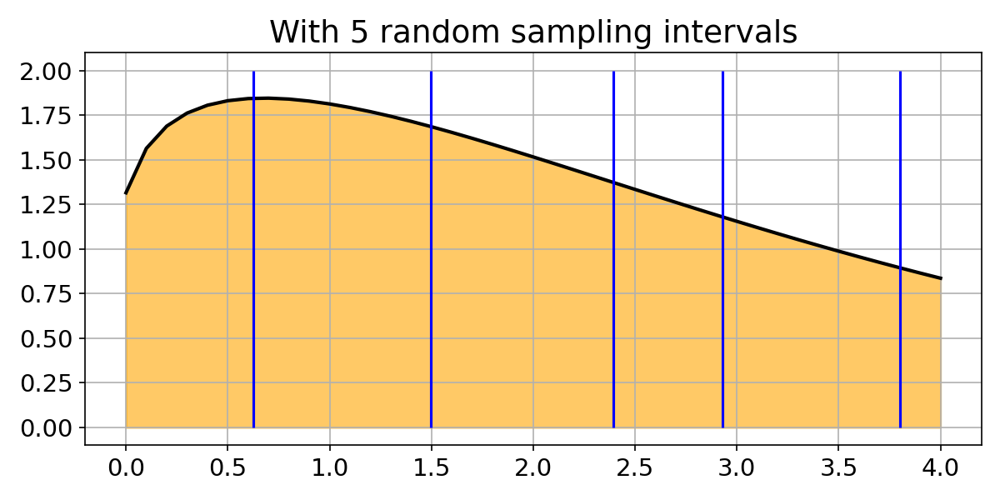
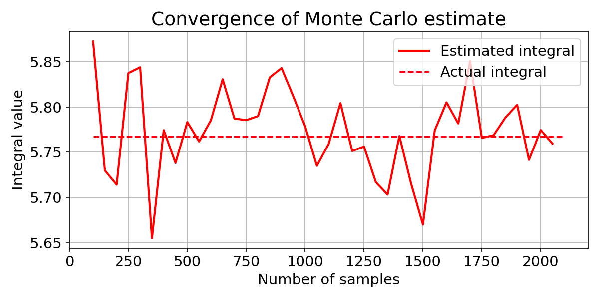
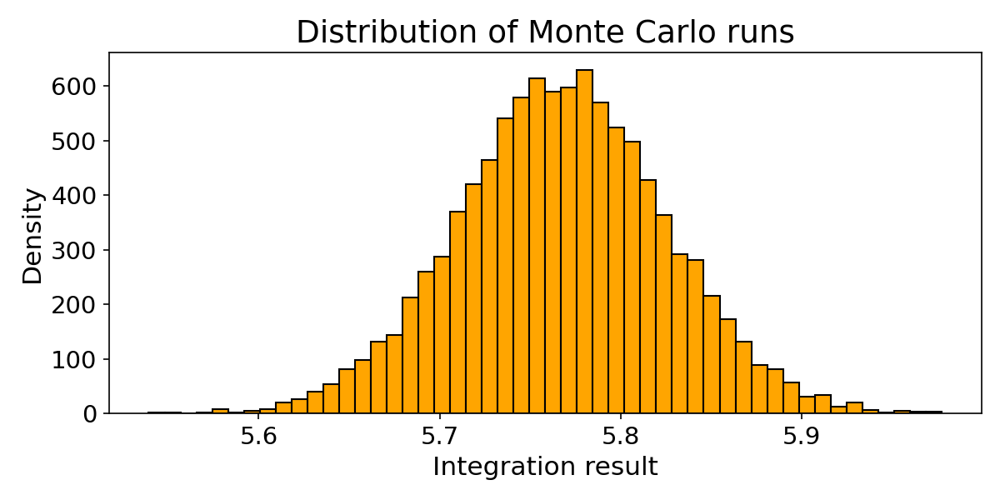

# Monte Carlo Integration

## The Problem

How do you compute a definite integral when the function is complex and doesn't have a neat closed-form antiderivative?

For example, consider:

$$\int_{0}^{4}\sqrt[4]{15x^3+21x^2+41x+3} \cdot e^{-0.5x} \, dx$$

This is not something you'd want to solve by hand. Here's what the function looks like:



---

## Classical Approach: Riemann Sums

The traditional numerical method divides the interval $[a, b]$ into $n$ equal sub-intervals and sums up the areas of thin rectangles:

$$\int_a^b f(x)\,dx \approx \sum_{i=1}^{n} f(x_i) \cdot \Delta x$$

where $\Delta x = \frac{b-a}{n}$.


This works, but requires **evenly spaced** evaluation points. For high-dimensional integrals or irregular domains, the number of required points explodes (curse of dimensionality).

---

## The Monte Carlo Idea

Instead of evaluating $f(x)$ at evenly spaced points, what if we just pick **random** points?



The Monte Carlo estimator for a definite integral is:

$$\int_a^b f(x)\,dx \approx \frac{b - a}{n} \sum_{i=1}^{n} f(x_i)$$

where $x_1, x_2, \ldots, x_n$ are drawn **uniformly at random** from $[a, b]$.

### Why does this work?

By the **Law of Large Numbers**, the sample mean of $f(x_i)$ converges to the expected value $E[f(X)]$ as $n \to \infty$. Since $X \sim \text{Uniform}(a, b)$:

$$E[f(X)] = \frac{1}{b-a}\int_a^b f(x)\,dx$$

Rearranging:

$$\int_a^b f(x)\,dx = (b-a) \cdot E[f(X)] \approx \frac{b-a}{n}\sum_{i=1}^{n} f(x_i)$$

---

## Implementation

```python
def monte_carlo(func, a=0, b=1, n=1000):
    u = np.random.uniform(size=n)
    u_funct = func(a + (b - a) * u)
    s = ((b - a) / n) * u_funct.sum()
    return s
```

**How it works:**
1. Draw `n` uniform random numbers $u_i \in [0, 1]$
2. Map them to the interval $[a, b]$: $x_i = a + (b-a) \cdot u_i$
3. Evaluate $f(x_i)$ at each random point
4. Compute the average and scale by the interval width $(b - a)$

For our integral with `n=100`:
```python
monte_carlo(f1, a=0, b=4, n=100)
# ≈ 5.77 (varies each run)
```

The actual value (via `scipy.integrate.quad`): **≈ 5.7674**

---

## Convergence

As we increase the number of samples, the Monte Carlo estimate gets closer to the true value:



With fewer samples, the estimate fluctuates significantly. As $n$ grows, it stabilizes around the true integral value (dashed line). The convergence rate is $O(1/\sqrt{n})$ — to halve the error, you need 4× more samples.

---

## Distribution of Estimates

Running the Monte Carlo simulation **10,000 times** (each with $n = 500$ samples) shows the distribution of results:



The estimates form a **normal distribution** centered at the true integral value — a consequence of the **Central Limit Theorem**. This tells us:

- The method is **unbiased** (centered on the correct answer)
- Individual runs will vary, but the average over many runs is accurate
- The spread (standard deviation) decreases with more samples per run

---

## Key Takeaways

| Aspect | Detail |
|---|---|
| **Core idea** | Approximate integrals using random sampling instead of deterministic grids |
| **Foundation** | Law of Large Numbers guarantees convergence |
| **Convergence rate** | $O(1/\sqrt{n})$ — independent of dimensionality |
| **Strength** | Scales well to high-dimensional integrals where grid methods fail |
| **Weakness** | Slow convergence for 1D problems compared to quadrature methods |
| **Error distribution** | Normal (by CLT), so confidence intervals are easy to compute |

Monte Carlo integration shines in **high-dimensional** problems (physics simulations, financial modeling, Bayesian inference) where traditional numerical methods become computationally infeasible.
